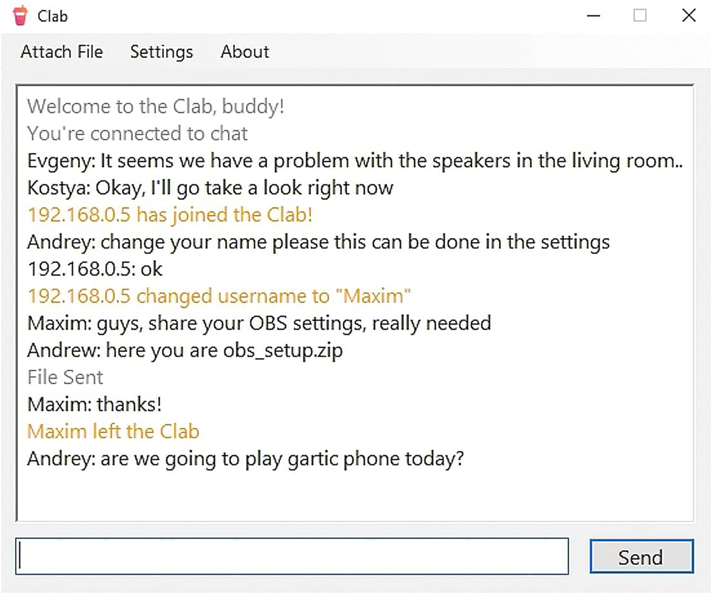

 

    
    

        Group chat at home, in a cafe, office
         
        <a href="https://github.com/2trvl/clab/releases/latest/download/Clab-0.0.1.zip"><strong>Download »</strong></a>
    

 

## Table of contents
1. [What it does](#what-it-does)
2. [How to use](#how-to-use)
3. [I don't see messages from others](#i-don't-see-messages-from-others)
4. [Screenshots](#screenshots)
5. [Built with](#built-with)
6. [Technical aspects](#technical-aspects)
    * [Json](#json)
    * [Logs](#logs)
    * [Signals](#signals)
    * [Messages](#messages)
    * [GUI](#gui)
7. [License](#license)

 

## What it does
Creates a group chat on the local network that does not require Internet access. Send messages and files between your devices privately!
It can be used:
* in public Wi-Fi locations
* at boot camp, party or another event
* on a hotel floor without network authentication

 

## How to use
Connect your device to the network using Wi-Fi or Ethernet. Run the program on your devices, they will automatically find each other and join the chat. In the settings, you can customize your name and folder for saving files.

 

## I don't see messages from others
Check if IGMP (Internet Group Management Protocol) is enabled on your router or switch. Also, make sure that you are connected to the same network as the people you chat with.

If that doesn't help, then there are virtual network adapters that are causing this problem, you can determine them with Wireshark.

If you are using VirtualBox:
1. Press Win+R and type ncpa.cpl
2. Right click 'VirtualBox Host-Only Network', go to Properties
3. Double click "Internet Protocol Version 4 (TCP/IPv4)" under 'This connection uses the following items'
4. In the Properties page, click "Advanced..."
5. In the "Advanced TCP/IP Settings", tab "IP Settings", uncheck the box marked "Automatic Metic" and type in 800 

 

## Screenshots

 

## Built with
* Newtonsoft.Json
* Windows Forms

Clab's interface uses the Windows API, which makes it impossible to create a Mono port. And Windows Forms do not allow to make a good adaptive application. So it would be nice to use WPF instead.

 

## Technical aspects

 

### Json
I wrote class `JsonFile` to work with JSON files. It uses `ExpandoObject` to create classes in runtime. Thus, you can create an object of any structure and serialize it using the Newtonsoft.Json library.

I used JSON in this project, as it is easy not only to store but also to transfer.

Also I didn't want to mess around with databases because I think the structure is very simple. Perhaps this may be slightly reflected in the consumption of RAM, but so far I have not noticed such a problem. 

The `load_history` function clears the history for previous days since there is no point in storing local chats forever.

 

### Logs
I didn't want to use someone else's library, so I created a simple logging system.

It has 3 default levels: `info`, `warning`, `error`. And can be easily expanded if needed.

There is only 1 problem, this is a slow HDD, sometimes it happens that several threads call the log, and an `IOException` occurs. It would probably be nice to add a queue, but for now, I let it take its course. Moreover, the project can be debugged in Visual Studio, where the log is output to the console.

 

### Signals
Devices must find each other before they can start messaging. To do this, there is the following set of 4 signals: `Connect`, `Callback`, `Request` and `Disconnect`.

Signals are transmitted over UDP to the multicast group `224.100.0.1`. I decided to use multicast to avoid broadcasting, which is sometimes ignored by the router, also to reduce the number of packets.

After receiving the `Request` signal, one server is selected among the computers chain, the rest are connected to it via TCP. This approach is to send messages reliably and not flood the network with a large number of packets, as it would be with P2P or pure UDP.

if the network is idle for 5 seconds without other participants, the computer will become a server automatically. 

 

### Messages
Messages are sent over TCP like this: [ MessageByteSize ] [ Message ]. Also, a file can be attached to each message, which is sent using separate TCP connections to increase speed: [ FileNameByteSize ] [ FileName ] [ FileByteSize ] [ File ].

The data is sent to the server, which forwards it to the rest of the chat participants. Therefore, the user who acts as a server has some responsibility. If the server closes the program, an attempt will be made to forward all current data, and then the next computer in the chain will take the place of the server.

When sending messages and files, they are divided into chunks of `1024 bytes`, for files, the value is increased to `100 * 1024` at a time, but iterations are performed synchronously. It took me 4 minutes to send a 300MB video.

 

### GUI
Yes, developing an interface on Windows Forms in 2022 is strange. But this was one of the conditions of coursework. At least I had fun writing the `ExRichTextBox` class with alerts muting, selection discarding and inner margins & buttons.

One time the entire graphic part was erased from the bug with the .resx resource file. Fortunately, I managed to restore the project by decompiling a .dll. CoolStoryBob

So, it's time to finish this README, have a nice day :)

 

## License
Distributed under the MIT License, do all that you want with this code.

 

<a href="#top">[ ↑ ]</a>

